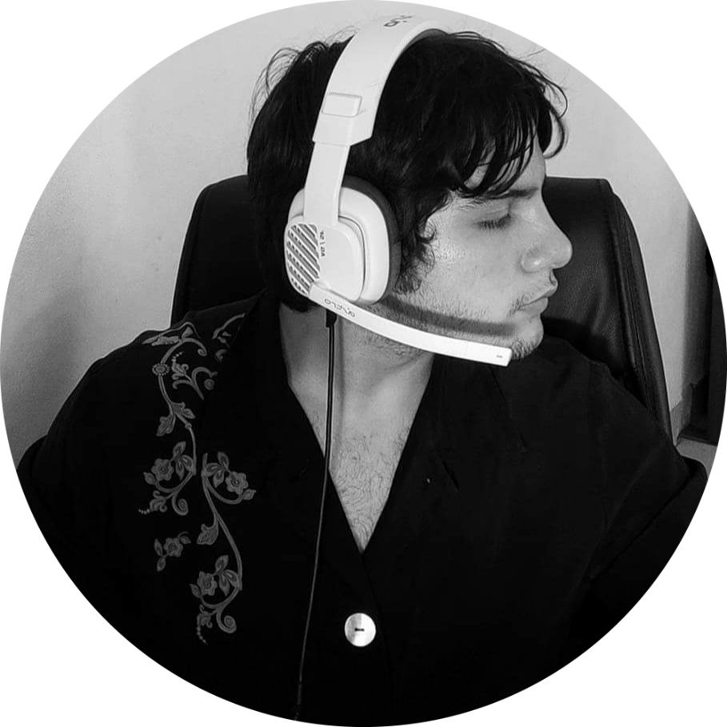

 
 <h2 align="center">Leoncio Pavón </h2>
 
Information Systems Engineering student
 
 

## About Me:
**No se que poner** 
- 🔭I’m currently working on: ...
- 🌱 I’m currently learning: React js
- 📫 <a href="mailto:leonciox5000@gmail.com">Send me and email!</a>

## Languages:
- Spanish (Main)
- English 
- Chinese (In progress...) 

## Programming Languages:
**Mas tarde lo pongo** 

## Tools:
**Mas tarde lo pongo** 

##  GitHub Flows: 

Github Stats

 

 
 
 

Most used Lang

 

